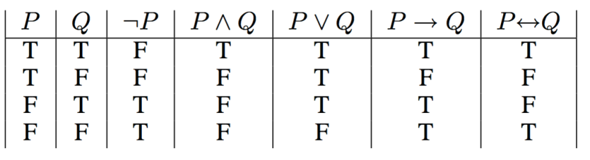

# DS101 Notes
 Instructor: Prof Michael Guerzhoy  
 [The course website is now open](https://www.cs.toronto.edu/~guerzhoy/ds101/)  
 Notes taken by: Skyler Han  
 
# lecture 1
- **Important resources:**  
   [Course Discord: will be used for Q&A](https://discord.gg/cgdSnbbK)  
   [SML201: a similar course taught by the same prof](http://www.cs.toronto.edu/~guerzhoy/201s20/)
   
- **What is needed for the course**  
   R + Rstudio  
   [An online version of Rstudio](https://posit.cloud/)
- **Why learning R**
   - It runs faster
   - Cleaner code -> fewer bugs
- **What is data science?** 
   
  
## Some Basic R 
First, let's evaluate some R expressions in the console. The simplest expressions are numerics and strings:

```R
42
```

```R
"Hello"
```

R simply repeats these values

A more complex expression is something like `42 + 43`. Let's try this:
```R
42 + 43
```
>85  

R **evaluated** the expression and gave us the value back. We can evaluate more complex expressions too:

```R
(45 - 43) ** 3
```
> 8
### We can also evaluate logical values
```R
5 == (4 + 1)
```
>TRUE
```R
2**10 > 10**3
```
>TRUE
```R
 #logical values
 TRUE,FALSE
```
### We can print out stuff using cat in R
```R
cat("Hi engsci!")
```
> Hi engsci!
### Here's how we assign values to a variable
```R
a <- 5
```
Here we assign 5 to the variable a, it is worth noting that `a=5` also works
## Conditionals
Do different things depending on the value of some prior computations
```R 
n <- -25
if(n>=0){
  cat(n)
}else{
  cat(-n)
}
```
> 25
  
This is the same as saying
```R 
n <- -25
if(-25>=0){
  cat(-25)
}else{
  cat(-(-25))
}
```
> Output: 25
## Functions
Functions are what we can do to simplfy the program.
> Don’t Repeat Yourself -- Andy Hunt
```R
square <- function(x){
  x**2
}
square(-2)
```
> 4

 ## Now we combine what we've learnt today together by defining the absolute value function
```R
my_abs <- function(x){
  if(x>=0){
    x
  }else{
    -x
  }
}
cat(my_abs(-4))
```
> 4

# Lecture 2
Todays lecture covered:
- Review functions
- Algebraic approach to understanding functions in programming
- Function stepping
- Use chapgpt to help learn about function
- Vector data frames, etc
## Function reviews:
$f(x)=x^2+1$ is the same thing as saying
```R
f <- function(x){
  x**2+1 #(body of the funtion)
}
```
R uses a different syntax from math  
**Syntax**: the rules according to which sentences are constructed in language

**Examples**: In English, you should say `I ate lunch` instead of `lunch I ate`
## Debugging(Make things right)
Let's look at this function
```R
f <- function(x){
  x**2 + 
}
cat(f(5))
```
>Error: unexpected '}' in  
"  x**2 +   
}"
To solve this issue, we just look at the error message in the console and debug
## Local variables and "scratch work"

Here is a slightly more complicated function

```R
h <- function(x){
  y <- 2 * x
  y ** 2 - x
}
```

Here, we defined a local variable `y` to help us with the computation. The process we use is

We want to compute `h(2)` 

We substitute `x <- 2`

We evaluate and substitue `y <- 2 * 2` (i.e., 4)

The value the function computes is $4^2 - 2 = 14$

The value of `h(2)` was evaluated to 14.


Note that we cannot access `y` outside of the function `h`. That makes sense: `y` is defined in terms of the parameter `x`, which might change.

## Algebraic approach to understand functions in programming
Let's look at the function to find roots for quadratic equations  
The solution of $ax^2+bx+c=0$ are
### $r_{1,2} = \frac{-2b \pm \sqrt{b^2-4ac}}{2a}$
```R
sq.roots <- function(A,B,C){
  disc <- B**2-4 * A * C
  if(disc>0){
    r1 <- -B+ sqrt(disc)/(2*A)
    r2 <- -B - sqrt(disc)/(2*A)
    c(r1,r2)
  }else if(disc == 0){
    r <- -B/(2*A)
  }else{
    c()
  }
}
```  

Let's see how this function solves the equation $x^2+2x+1=0$
We know that this function has one root, which is $x=-1$  
Now we show the function step by step

```R
sq.roots(1,2,1)
# Substitution
disc <- 2**2-4 * 1 * 1
  if(disc>0){
    r1 <- -2+ sqrt(disc)/(2*1)
    r2 <- -2 - sqrt(disc)/(2*1)
    c(r1,r2)
  }else if(disc == 0){
    r <- -2/(2*1)
  }else{
    c()
  }
##############################################

disc <- 0
if(FALSE){
  r1 < -1
  r2 < -1
  c(-1,-1)
}else if(TRUE){
  r <- -1
}else{
  c()
}
##############################################
r <- -1
```

## *Eager evaluation and Delayed evaluation(Optional)*
Credit: [How do you compare and contrast lazy and eager evaluation in different programming languages?](https://www.linkedin.com/advice/1/how-do-you-compare-contrast-lazy-eager-evaluation)
### Delayed Evaluation: 
Call by need, this is a technique where an expression is only evaluated when its value is needed. This means that the computation is deferred until the last possible moment, and the result is cached for future use. Delayed evaluation can avoid unnecessary work and save memory.Some programming languages that support lazy evaluation are Haskell, Scala, Clojure, `R` and `Python`(the language that will be covered in [*ESC180*](https://www.cs.toronto.edu/~guerzhoy/180/index.html#resources)).

### Eager Evaluation:
Eager evaluation, also known as call-by-value, is a technique where an expression is evaluated as soon as it is bound to a variable or passed as an argument. This means that the computation is performed upfront, and the result is stored in memory. Some programming languages that use eager evaluation are `C`(the language that will be covered in [*ESC190*](https://www.cs.toronto.edu/~guerzhoy/190/)) , Java, Ruby, and JavaScript.

### Comparing delayed and eager evaluation

We now compare this two evaluations by examples
```R 
f <- function(x){
  cat("f")
  x+1
}
g <- function(x){
  cat("g")
  x*2
}

if (f(3)>4){
  g(5)
}else{
  g(6)
}
```
In a **delayed** language, the function `f(3)` is not evaluated until it is compared to `4`, and the function `g(5)` or `g(6)` is not evaluated until the `if` condition is resolved. This means that only one of the functions `g` will be executed, and the output will be  `"f g"`. In an **eager** language, the function `f(3)` is evaluated as soon as it is encountered, and both functions `g(5)` and `g(6)` are evaluated before the `if` condition is checked. This means that both functions `g` will be executed, and the output will be `"f g g"`.

## Using ChatGPT to evaluate the function 
See [this](https://chat.openai.com/share/ab74964e-151f-4408-8739-0bb17836f15a)

The basic logic of using ChatGPT is called prompting, which is teaching AI here you want to achieve. Here we want ChatGPT to help us analyze if our step-by-step anaylysis of the function `exceptional day` is right

## Computing values vs printing them to the screen

Consider the following two functions:

```R
emo_state <- function(score){
  if(score >= 98){
    "Hooray"
  }else if(score >= 95){
    "OK"
  }else{
    "PANIC"
  }
}
```

```R
cat_emo_state <- function(score){
  if(score >= 98){
    cat("Hooray")
  }else if(score >= 95){
    cat("OK")
  }else{
    cat("PANIC")
  }
}
```

The function `emo_state` *computes* a value, just like our functions `f` and `g` above. For example, `emo_state(99)` evaluates to `"Hooray!"`. You can see this in the following example:

```R
a <- emo.state(99)
cat(a)
```
> Hooray!

We first evaluated `emo.state(99)` and put it in `a`. Then we gave an instruction to R to print the value of `a` to the screen.

On the other hand, consider this piece of code:

```R
a <- cat_emo_state(99)
```
> Hooray!  

This already had the effect of printing an output to the screen. That's because when R sees `cat("Hooray")`, it outputs `Hooray` to the screen. But the value that the function computes, which is `cat("Hooray")` is not `"Hooray"`. In fact, it is

```R
a
```

You will *very rarely* need to use `cat` inside functions. Outside of Precept 1, you just should not use it at all in this course.

## Vectors 
### What is a vecotr in R?
A vector is an order collection of elements of the **same** type.  
Here are examples of vectors in R.
```R
c(5,6,7)
c("dog","cat")
v <- c(TRUE,FALSE,TRUE,TRUE) 
```
### Retrieving value of elements in a vector
We can access the value of elements in a vector by specifying the location of it.
```R
v[1]
v[2]
```
>TRUE  
>FALSE

### Inserted Functions in R to manipulate vectors
#### sort
```R 
v <- c(2,-50,2,4)
sorted_v <- sort(v)
```
Note that the `sort` function in R sort a list in non-decreasing order.  
`sorted_v` is `(-50,2,2,4)` here 

#### length
```R
v <- c(2,-50,2,4)
length(v)
```
The `length` function gets the length of a vector. In this case, the output should be `4`.

#### max
```R
v <- c(2,-50,2,4)
max(v)
```
The `max` function gets the maxinum element a vector. In this case, the output should be `4`.

#### Example: How to define a function without using max?
<details><summary>Answer
</summary><pre>

Note that the last element of the sorted_v is the biggest element in the vector
```R 
my_max <- function(v){
  sort(v)[length(v)]
}
my_max(c(5,2,5,10,2))
####################
sort(c(5,2,5,10,2))[length(c(5,2,5,10,2))]
####################
c(2,3,5,5,10)[5]
####################
10
```
</pre></details>  

### How to merge vectors?
```R 
v <- c(5,3)
v <- c(v,1)
```
`v` is now `5 3 1 `


## Operating on logical values

Suppose we wanted something fancier: extracting all elements between 400 and 550. In other words, suppose we want the elements that are both larger than 400 and smaller than 550. To achieve this, we would want to combine the conditions "larger than 400" and "smaller than 550".

We can do this using logical operators

    AND:    a & b. TRUE only if a is TRUE and b is TRUE. FALSE otherwise
    OR:     a | b. TRUE if at least one of a or b is TRUE, FALSE otherwise
    NOT:    !a. TRUE if a is FALSE, FALSE if a is TRUE

In mathematics, we have such thing called Truth Tables


Some examples(credit: [SML201 2020](https://www.cs.toronto.edu/~guerzhoy/201s20/lectures.html)):

```R
pie <- TRUE
icecream <- FALSE
pie | icecream
```

```R
pie <- FALSE
icecream <- FALSE
pie | icecream
```


```R
pie <- TRUE
icecream <- FALSE
pie & icecream
```

```R
pie <- TRUE
icecream <- TRUE
pie | icecream
```

Note: this is not quite how it works in English. If I say I will have pie or icecream, and then have both, that means what I said wasn't true. But for R, the expression `pie | icecream` is TRUE. Technically, `|` is called "inclusive OR" (as opposed to the "exclusive OR" we usually mean in English.)


```R
pie <- FALSE
icecream <- TRUE
pie | icecream
```

```R
pie <- FALSE
icecream <- FALSE
pie | icecream
```

```R
pie <- TRUE
!pie
```

### Inclusive OR and exclusive OR (XOR)

So how *do* you make an expression in R that corresponds to "I will have ice cream or pie"? That is, we want to write an expression that will be `TRUE` whenever `pie` or `icecream` are true, but not both.

Here are several ways of accomplishing this. They all do the same thing

    (pie | ice.cream) & !(pie & ice.cream)
    (pie == T & ice.cream == F) | (pie == F & ice.cream == T)
    (pie & !ice.cream) | (!pie & ice.cream)
    pie != ice.cream
    xor(pie,ice.cream)
### Select elements in a vector based on conditions
Select elements in v that are between 0 and 3
```R 
v <- c(5, 2, -1, 1)
v[v >= 0 & v<= 3 ]
```
> 2 1


   
