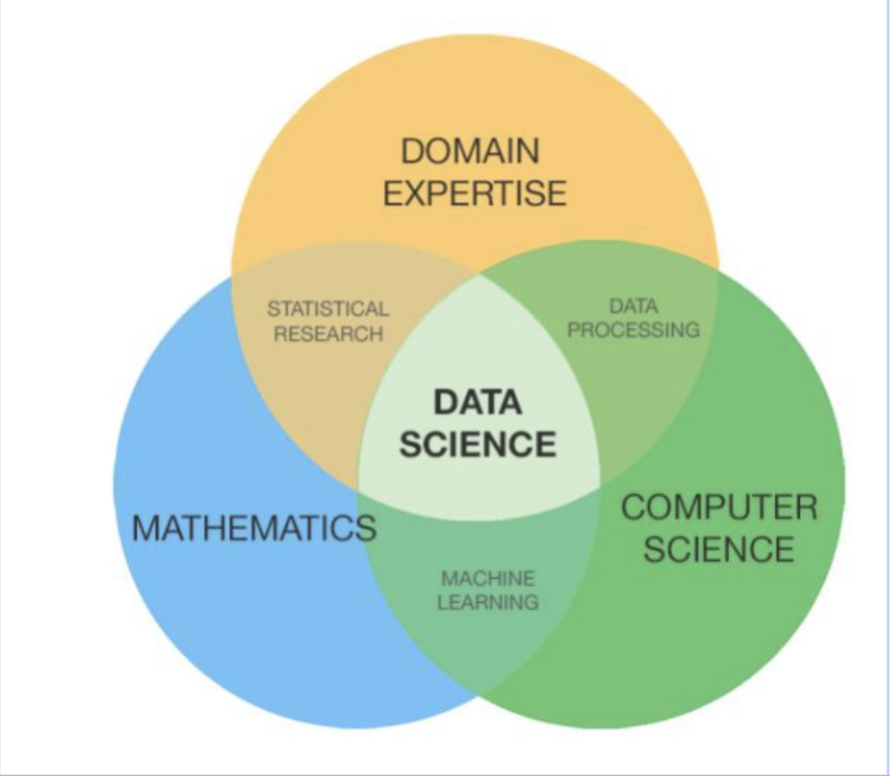
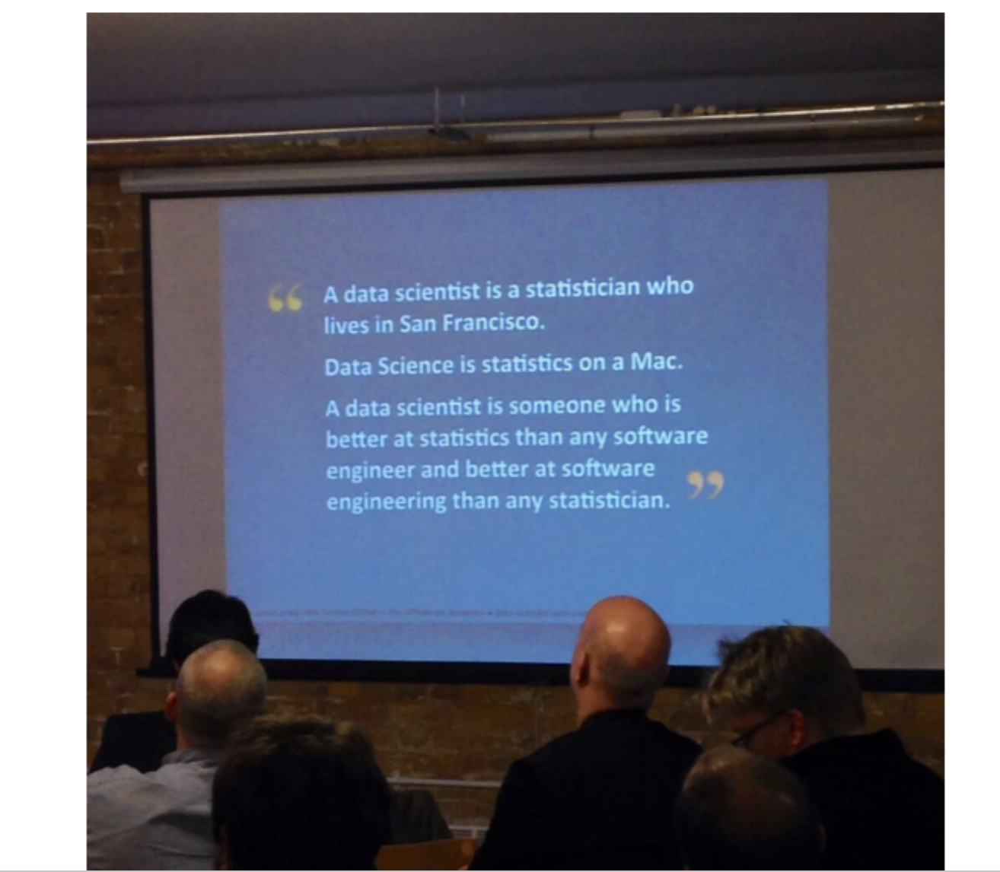

# DS101 Notes
 Instructor: Prof Michael Guerzhoy  
 Notes taken by: Skyler Han  
 
# lecture 1
- **Important resources:**  
   [Course Discord: will be used for Q&A](https://discord.gg/cgdSnbbK)  
   [SML201: a similar course taught by the same prof](http://www.cs.toronto.edu/~guerzhoy/201s20/)
   
- **What is needed for the course**  
   R + Rstudio  
   [An online version of Rstudio](https://posit.cloud/)
- **Why learning R**
   - It runs faster
   - Cleaner code -> fewer bugs
- **What is data science?** 
   
  
## Some Basic R 
First, let's evaluate some R expressions in the console. The simplest expressions are numerics and strings:

```{r}
42
```

```{r}
"Hello"
```

R simply repeats these values

A more complex expression is something like `42 + 43`. Let's try this:
```{r}
42 + 43
```
>85  

R **evaluated** the expression and gave us the value back. We can evaluate more complex expressions too:

```{r}
(45 - 43) ** 3
```
> 8
### We can also evaluate logical values
```{r}
5 == (4 + 1)
```
>TRUE
```{r}
2**10 > 10**3
```
>TRUE
```R
 #logical values
 TRUE,FALSE
```
### We can print out stuff using cat in R
```{r}
cat("Hi engsci!")
```
> Hi engsci!
### Here's how we assign values to a variable
```{r}
a <- 5
```
Here we assign 5 to the variable a, it is worth noting that `a=5` also works
## Conditionals
Do different things depending on the value of some prior computations
```R 
n <- -25
if(n>=0){
  cat(n)
}else{
  cat(-n)
}
```
> 25
  
This is the same as saying
```R 
n <- -25
if(-25>=0){
  cat(-25)
}else{
  cat(-(-25))
}
```
> Output: 25
## Functions
Functions are what we can do to simplfy the program.
> Don’t Repeat Yourself -- Andy Hunt
```R
square <- function(x){
  x**2
}
square(-2)
```
> 4

 ## Now we combine what we've learnt today together by defining the absolute value function
```R
my_abs <- function(x){
  if(x>=0){
    x
  }else{
    -x
  }
}
cat(my_abs(-4))
```
> 4


   
